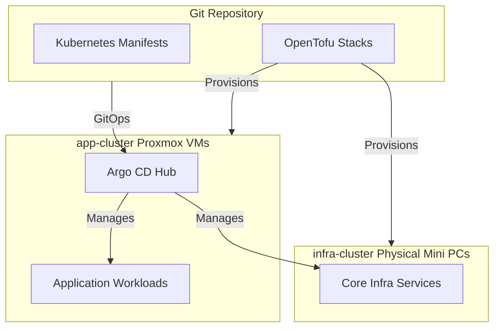

# 🏛️ Homelab Architecture Plan

## 🎯 Objective

Operate the Talos/Kubernetes homelab from this repository as the active deployment home for applications and infrastructure services.

## 🌱 Lineage & Origin

This codebase was originally bootstrapped using [ajaykumar4/cluster-template](https://github.com/ajaykumar4/cluster-template) (utilizing Talos Linux, Argo CD, and `bjw-s/app-template` Helm chart patterns). It has since been customized into a **dual-cluster operational topology** managed by a single central Argo CD hub.

## 🏗️ Active Structure

-   `app-cluster`: Primary application cluster running on Proxmox Talos VMs, hosting general workloads and the central Argo CD hub.
-   `infra-cluster`: Physical mini-PC infrastructure cluster running core baseline services (`pulse-infra`, `kestra-infra`, `reloader-infra`).
-   `infra/terraform_proxmox/`: Proxmox VMs and Talos cluster infrastructure.
-   `infra/terraform_cloudflare/`: Kubernetes Cloudflare tunnel, DNS, Access resources, and tunnel credentials.
-   `infra/terraform_localdns/`: Kubernetes local DNS OpenTofu stack.
-   `talos/`, `kubernetes/`, `bootstrap/`, and `.taskfiles/`: Talos, Argo CD, and Kubernetes workspace migrated from the legacy cluster repo.
-   `kubernetes/apps/app-cluster/default/`: lightweight default-namespace apps used for baseline GitOps validation and small utility workloads.
-   `kubernetes/apps/app-cluster/` & `kubernetes/apps/infra-cluster/`: Workload manifests separated by destination cluster.
-   `kubernetes/argo/apps/app-cluster/` & `kubernetes/argo/apps/infra-cluster/`: Argo CD Applications separated by destination cluster.

## 🚧 Current Migration Direction

-   `project-homelab` becomes the main source of truth.
-   The old `home-argo-cluster-2025` repo stays intact during transition.
-   Argo CD will be repointed to `project-homelab`.
-   The active Talos cluster is now modeled as three control-plane nodes only.
-   Historical worker VMs remain infrastructure artifacts for rollback or later reuse, but are no longer part of the committed Talos node inventory.
-   Former host-level Docker services are being retired or migrated into Kubernetes.

## 🤔 Assumptions

-   The imported cluster should keep using its current Proxmox IDs, node IPs, Talos secrets, and Terraform state.
-   Secrets and runtime artifacts remain local-only and gitignored.
-   Doppler project names and existing external integrations can stay unchanged during the repo migration.
-   Removing workers from Talos configuration does not require deleting the underlying VM definitions on the same change.
-   Splitting OpenTofu directories must preserve Kubernetes resource addresses so existing tunnels, DNS records, and Access apps are not recreated.

## ✅ Validation Checks

-   `task tf:init`
-   `task tf:plan`
-   `task tf:proxmox:plan`
-   `task tf:cloudflare:plan`
-   `task tf:localdns:plan`
-   `kubectl get nodes`
-   `talosctl --talosconfig talos/app/clusterconfig/talosconfig config info`
-   `task sync-argo-bootstrap`

## ↩️ Rollback

-   Repoint Argo CD back to `home-argo-cluster-2025`.
-   Continue operating from the original repo because its state and files remain untouched.
-   Restore any copied local-only runtime files from the old workspace if the new one is discarded.
-   Reintroduce worker nodes by restoring them to `nodes.yaml`, regenerating `talos/app/talconfig.yaml`, and re-running Talos config generation.
-   If the OpenTofu stack split needs to be reversed before apply, move the directories and local state files back to the previous layout.
