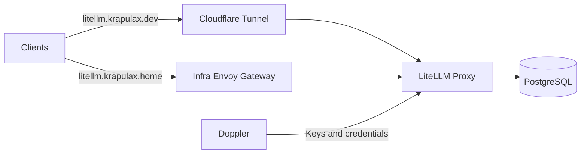

# LiteLLM Infra Deployment

Deploy LiteLLM on the infra cluster as the shared LLM gateway for homelab services.
Keeping the gateway outside the app cluster lets application workloads use a stable
OpenAI-compatible endpoint while the app cluster is rebuilt or maintained.

## Architecture

-   Namespace: `ai`
-   Runtime: upstream LiteLLM Helm chart pinned to release `v1.101.0`.
-   Database: dedicated PostgreSQL Helm release with a retained `local-path` PVC.
    LiteLLM and its migration Job use the chart's configured Postgres bootstrap
    credential pair. The chart does not create the optional application user.
-   Placement: LiteLLM and PostgreSQL are pinned to `infra-cp-01`.
-   Networking: the infra Envoy gateway serves `litellm.krapulax.home`; the infra
    Cloudflare tunnel serves `litellm.krapulax.dev`.
-   Homepage runs on the app cluster and cannot discover infra-cluster routes, so
    the Homepage annotation generator mirrors LiteLLM in its static services
    configuration.
-   Model catalog: direct OpenAI and OpenRouter. Names are
    provider-qualified (for example, `openai/gpt-5-mini`) so callers explicitly
    select the provider and cost/quality tier.

## Security

-   `LITELLM_MASTER_KEY`, `LITELLM_SALT_KEY`, provider credentials, and PostgreSQL
    credentials are synced from Doppler (`home-dc-kubernetes/infra`).
-   No secret values are stored in Git.
-   The master key is required for proxy API calls and the Admin UI.
-   Public access should be protected by a Cloudflare Access policy before merging.
-   The Service remains `ClusterIP`; only Envoy and the Cloudflare tunnel expose it.

## Required Doppler secrets

-   `LITELLM_MASTER_KEY` (must start with `sk-`)
-   `LITELLM_SALT_KEY` (generate once and never rotate after keys are created)
-   `AI_OPENAI_API_KEY`
-   `AI_OPENROUTER_API_KEY`
-   `LITELLM_POSTGRES_USER`
-   `LITELLM_POSTGRES_PASSWORD`
-   `LITELLM_POSTGRES_DB` (recommended value: `litellm`)
-   `LITELLM_USERDB_USER` (recommended value: `litellm`)
-   `LITELLM_USERDB_PASSWORD`

## Assumptions

-   `infra-cp-01` remains the preferred node for infra support services using
    retained local storage.
-   The `local-path` StorageClass and infra Envoy gateways already exist.
-   The app-cluster Cloudflare external-dns controller continues managing public
    DNS records for infra services.
-   One replica is appropriate while PostgreSQL uses a single local volume.

## Validation

1. `kubectl kustomize kubernetes/apps/infra-cluster/ai/litellm`
2. Confirm Argo sync for `litellm-support-infra`, followed by `litellm-infra`.
   Confirm the migration Job succeeds before the proxy Deployment starts.
3. `kubectl -n ai get pods,pvc,svc,httproute`
4. Confirm both LiteLLM and PostgreSQL are scheduled on `infra-cp-01`.
5. `curl -fsS http://litellm.ai.svc.cluster.local:4000/health/readiness`
6. `dig +short litellm.krapulax.home` should return the infra Envoy address.
7. `dig +short litellm.krapulax.dev CNAME` should return
   `external-infra.krapulax.dev`.
8. Open `https://litellm.krapulax.dev/ui` through Cloudflare Access and sign in
   with `LITELLM_MASTER_KEY`.
9. Create a virtual key and make test requests to `openai/gpt-5-mini`,
   `openrouter/gemini-2.5-flash`.

## Rollback

1. Revert this PR or delete the `litellm-infra` and `litellm-support-infra`
   Argo Applications.
2. Argo prunes the LiteLLM, routing, and secret-sync resources.
3. The PostgreSQL PVC remains because `keepPvc` is enabled.
4. Recreate the Argo Application to restore LiteLLM against the retained data.
5. Delete the PVC manually only after confirming the deployment will not be restored.
