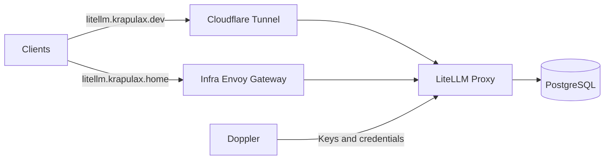

# LiteLLM Infra Deployment

Deploy LiteLLM on the infra cluster as the shared LLM gateway for homelab services.
Keeping the gateway outside the app cluster lets application workloads use a stable
OpenAI-compatible endpoint while the app cluster is rebuilt or maintained.

## Architecture

```mermaid
flowchart LR
    Clients -->|litellm.krapulax.dev| CFT[Cloudflare Tunnel]
    Clients -->|litellm.krapulax.home| Envoy[Infra Envoy Gateway]
    CFT --> LiteLLM[LiteLLM Proxy]
    Envoy --> LiteLLM
    LiteLLM --> Postgres[(PostgreSQL)]
    Doppler -->|Keys and credentials| LiteLLM
```

-   Namespace: `ai`
-   Runtime: upstream LiteLLM Helm chart pinned to release `v1.101.0`.
-   Database: dedicated PostgreSQL Helm release with a retained `local-path` PVC.
    LiteLLM and its migration Job use the chart's configured Postgres bootstrap
    credential pair. The chart does not create the optional application user.
-   Placement: LiteLLM and PostgreSQL are pinned to `infra-cp-01`.
-   Networking: the infra Envoy gateway serves `litellm.krapulax.home`; the infra
    Cloudflare tunnel serves `litellm.krapulax.dev`.
-   Homepage runs on the app cluster and cannot discover infra-cluster routes, so
    the Homepage annotation generator mirrors LiteLLM in its static services
    configuration.
-   Model catalog: direct OpenAI and OpenRouter. Names are
    provider-qualified (for example, `openai/gpt-5-mini`) so callers explicitly
    select the provider and cost/quality tier.

## Free-model routing (2026-10-05)

Supersedes the 2026-10-02 Nemotron-first routing decision.

-   Expose Qwen3.8 27B, Gemma, and Nemotron under their full provider-qualified
    free model names so the health page identifies each endpoint.
-   Keep `openrouter/free` as a router model-group alias for Qwen. After one
    retry, general provider errors (including upstream 429s and availability
    failures) try Gemma, then Nemotron, in that order. Direct Qwen requests use
    the same fallback list; direct Gemma and Nemotron requests select only
    their named model. Use the alias for the full preference policy.
-   This is request-time failover, not a capacity reservation or proactive
    availability scan. Router cooldowns can temporarily skip failed deployments.
    If all candidates fail, return the error. Failover cannot repair an already
    started response stream or guarantee meaningful/nonempty model output.
-   The generic fallback policy does not cover context-window or content-policy
    errors; clients must use inputs and options compatible with their targets.
-   Remove `z-ai/glm-5.2:free`: that variant is absent from the current
    OpenRouter catalogue. Do not replace it with the paid variant.
-   All configured fallback destinations are free. Shared OpenRouter account
    limits can still exhaust all three endpoints; retries do not increase the quota.
-   Assumption: virtual keys used with the alias allow the underlying Qwen,
    Gemma, and Nemotron groups (or all models). Check restricted keys after sync.
-   Manage these routes in Git. Database-created models or router overrides
    must be checked separately if stale entries remain after reconciliation.
-   Security: reuse the existing Doppler credential; no new secrets or access
    paths. The retry setting applies to all configured model groups.

### Routing validation and rollback

1. Confirm Argo sync and the proxy restart with the updated config.
2. In Models + Endpoints, confirm the three distinct free endpoint names and
   inspect any remaining database-created entries separately.
3. With an authorized key, send a short chat completion to `openrouter/free`
   and each distinct free name. Check provider errors and routing in Logs.
4. In an isolated test configuration, make the Nemotron endpoint fail and
   confirm a request to the alias falls back to Gemma. Account-wide quota
   exhaustion is expected to fail both endpoints.
5. Roll back by reverting the routing PR and syncing Argo; no database or
   secret migration is required.

## Security

-   `LITELLM_MASTER_KEY`, `LITELLM_SALT_KEY`, provider credentials, and PostgreSQL
    credentials are synced from Doppler (`home-dc-kubernetes/infra`).
-   No secret values are stored in Git.
-   The master key is required for proxy API calls and the Admin UI.
-   The public API intentionally bypasses Cloudflare Access so non-browser
    OpenAI-compatible clients do not receive an authentication redirect.
    LiteLLM's master or virtual API key remains mandatory; do not expose this
    hostname without one.
-   The Service remains `ClusterIP`; only Envoy and the Cloudflare tunnel expose it.

## Required Doppler secrets

-   `LITELLM_MASTER_KEY` (must start with `sk-`)
-   `LITELLM_SALT_KEY` (generate once and never rotate after keys are created)
-   `AI_OPENAI_API_KEY`
-   `AI_OPENROUTER_API_KEY`
-   `LITELLM_POSTGRES_USER`
-   `LITELLM_POSTGRES_PASSWORD`
-   `LITELLM_POSTGRES_DB` (recommended value: `litellm`)
-   `LITELLM_USERDB_USER` (recommended value: `litellm`)
-   `LITELLM_USERDB_PASSWORD`

## Assumptions

-   `infra-cp-01` remains the preferred node for infra support services using
    retained local storage.
-   The `local-path` StorageClass and infra Envoy gateways already exist.
-   The app-cluster Cloudflare external-dns controller continues managing public
    DNS records for infra services.
-   One replica is appropriate while PostgreSQL uses a single local volume.

## Validation

1. `kubectl kustomize kubernetes/apps/infra-cluster/ai/litellm`
2. Confirm Argo sync for `litellm-support-infra`, followed by `litellm-infra`.
   Confirm the migration Job succeeds before the proxy Deployment starts.
3. `kubectl -n ai get pods,pvc,svc,httproute`
4. Confirm both LiteLLM and PostgreSQL are scheduled on `infra-cp-01`.
5. `curl -fsS http://litellm.ai.svc.cluster.local:4000/health/readiness`
6. `dig +short litellm.krapulax.home` should return the infra Envoy address.
7. `dig +short litellm.krapulax.dev CNAME` should return
   `external-infra.krapulax.dev`.
8. Call `https://litellm.krapulax.dev/v1/models` with a LiteLLM API key and
   confirm it returns JSON rather than a Cloudflare redirect.
9. Open `https://litellm.krapulax.dev/ui` and sign in with
   `LITELLM_MASTER_KEY`.
10. Create a virtual key and make test requests to `openai/gpt-5-mini`,
    `openrouter/free`.

## Rollback

1. Revert this PR or delete the `litellm-infra` and `litellm-support-infra`
   Argo Applications.
2. Argo prunes the LiteLLM, routing, and secret-sync resources.
3. The PostgreSQL PVC remains because `keepPvc` is enabled.
4. Recreate the Argo Application to restore LiteLLM against the retained data.
5. Delete the PVC manually only after confirming the deployment will not be restored.

## Next actions

-   [ ] Sync the routing change and verify the free alias and endpoint health.
-   [ ] Check restricted virtual-key access and any database router overrides.
