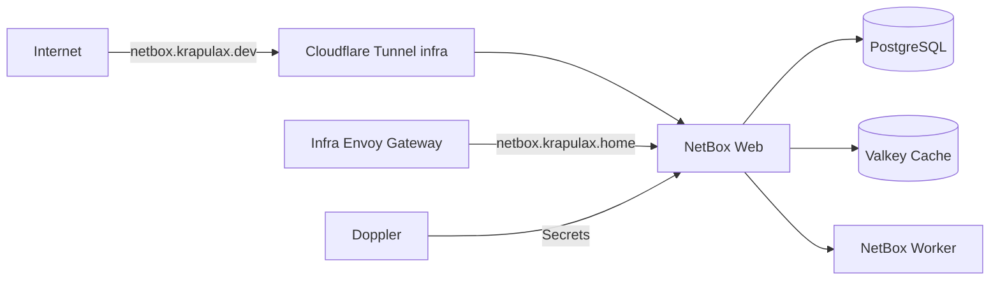

# 🌐 NetBox Infra Deployment

Deploy NetBox on the infra cluster as the homelab IPAM/DCIM source of truth
(sites, devices, IP addresses, circuits, cables, and related inventory).

## 🏛️ Architecture

-   Namespace: `netbox`
-   Runtime: upstream `netbox` Helm chart (8.3.49, app v4.6.7) with bundled
    bitnami PostgreSQL (standalone) and Valkey (standalone, cache-only).
-   Placement: NetBox web, worker, housekeeping cron, PostgreSQL and Valkey are
    all pinned to `infra-cp-01` (control-plane toleration), the same node as
    Kestra. This keeps `local-path` volumes node-local and avoids the already
    constrained worker node (`infra-wk-01` was ~63% of memory limits at audit).
-   Storage: `local-path` PVCs for NetBox media (`netbox-data`, 8Gi) and
    PostgreSQL (`netbox-postgresql-0`, 8Gi). Valkey is cache-only with no PVC.
-   Networking: internal HTTPRoute exposes NetBox through the infra Envoy
    gateway at `10.0.40.106`; public DNS points `netbox.krapulax.dev` at
    `external-infra.krapulax.dev`, and the infra Cloudflare Tunnel routes that
    hostname directly to the NetBox service.
-   Access: `netbox.krapulax.dev` is gated by Cloudflare Access (allow-only,
    same pattern as n8n). `netbox.krapulax.home` is LAN-only.

## 📌 Security

-   NetBox holds the network inventory (IPs, devices, credential references),
    so the public route is **allow-only via Cloudflare Access**; the internal
    route stays on the LAN.
-   Secrets (Django `secret_key`, superuser credentials) are synced from Doppler
    (`home-dc-kubernetes/infra`); nothing sensitive is committed to Git.
-   Pods run non-root where the chart supports it; the namespace enforces
    `pod-security.kubernetes.io/enforce: restricted`.
-   `allowedHosts` is restricted to the two NetBox hostnames.
-   All components have explicit resource requests/limits sized to
    infra-cluster capacity (see `docs/plan/netbox-rollout.md` for the table).

## 🤔 Assumptions

-   `infra-cp-01` is the preferred node for infra services; it has headroom
    (~4.8 CPU / ~10Gi) for NetBox alongside Kestra.
-   `netbox.krapulax.home` should resolve directly to the infra-cluster
    internal Envoy gateway (`10.0.40.106`), not the app-cluster gateway.
-   The bundled PostgreSQL (standalone) is sufficient for a homelab; move to an
    external DB operator if a clustered Postgres becomes necessary.
-   Valkey is a cache/task queue only — no persistence is needed.

## ✅ Validation

1. `kubectl kustomize kubernetes/apps/infra-cluster/netbox/netbox`
2. Confirm Argo sync for `netbox`.
3. `kubectl -n netbox get pods,pvc,httproute` — all running, PVCs bound.
4. Confirm all NetBox pods are scheduled on `infra-cp-01`.
5. `dig +short netbox.krapulax.home` should return `10.0.40.106`.
6. `dig +short netbox.krapulax.dev CNAME` should return `external-infra.krapulax.dev`.
7. `curl -I https://netbox.krapulax.dev` should hit Cloudflare Access, then NetBox.
8. Open the internal route and verify login + create a test site/IP record.

## ↩️ Rollback

See `docs/plan/netbox-rollout.md` — the short version: delete the Argo
Application (cascade) after exporting the inventory; remove the routes, DNS
records and Access app; local-path PVs are retained by the StorageClass but the
PVCs themselves are removed by a cascade delete unless annotated with
`helm.sh/resource-policy: keep` first.
