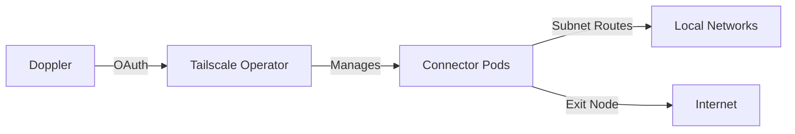

# 🔒 Tailscale Infra Routers

Deploy Tailscale routing through the Kubernetes Operator on `infra-cluster`.

## 🏛️ Architecture

-   The Tailscale Operator manages a Connector with two replicas.
-   Each Connector replica is an ephemeral Tailscale device managed by the Operator.
-   Connector pods use a ProxyClass that tolerates the infra control-plane taint and spreads replicas across hostnames.
-   Advertised subnet routes: `10.0.0.0/16` and `192.168.0.0/16`.
-   Both Connector replicas advertise themselves as exit nodes.

## 📌 Security

-   `TAILSCALE_OAUTH_CLIENT_ID` and `TAILSCALE_OAUTH_CLIENT_SECRET` are synced from Doppler (`home-dc-kubernetes/infra`) into the Operator's `operator-oauth` Secret.
-   The OAuth client needs write access to `General/Services`, `Devices/Core`, and `Keys/Auth Keys`, with the `tag:k8s-operator` tag.
-   Tailnet ACLs should make `tag:k8s-operator` an owner of `tag:k8s`, and auto-approve the `10.0.0.0/16`, `192.168.0.0/16`, and exit-node advertisements for `tag:k8s`.

## ✅ Validation

1. `kubectl kustomize kubernetes/apps/infra-cluster/network/tailscale-infra`
2. Confirm Operator and Connector status: `kubectl -n tailscale get pods` and `kubectl get connector infra-router`
3. Confirm routes and exit nodes in the Tailscale admin UI.
4. Test LAN reachability through Tailscale to both advertised ranges.

## ↩️ Rollback

1. Revert the PR or delete the `tailscale-infra` Argo Application.
2. Argo prunes the Connector and DopplerSecret.
3. Remove stale ephemeral nodes, routes, or exit-node approvals from the Tailscale admin UI if they remain visible.
