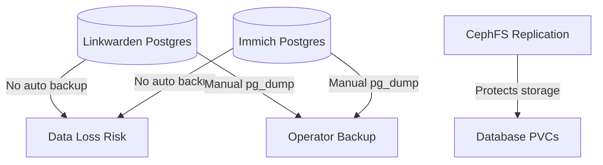

# 💾 Database Backups

This document tracks the backup strategy for databases in the cluster.

## 📌 Current State



### 🗄️ PostgreSQL Databases

| App        | Namespace    | PVC                               | Backup Strategy |
| ---------- | ------------ | --------------------------------- | --------------- |
| Linkwarden | productivity | linkwarden-postgres-data (CephFS) | None currently  |
| Immich     | media        | immich-database-data (CephFS)     | None currently  |

## 📝 Notes

-   All database PVCs are backed by CephFS with replication
-   No automated backup solution currently implemented
-   For production, consider:
    -   [Kasten K10](https://www.kasten.io/) - Kubernetes-native backup
    -   [Velero](https://velero.io/) - Generic K8s backup
    -   Custom cron job with pg_dump

## 💾 Manual Backup Example

To manually backup Linkwarden database:

```bash
kubectl exec -n productivity linkwarden-database-0 -- pg_dump -U linkwarden -d linkwarden > linkwarden-backup.sql
```

## 🔄 Recovery

For recovery instructions, see [Troubleshooting](/docs/operations/troubleshooting.md).
