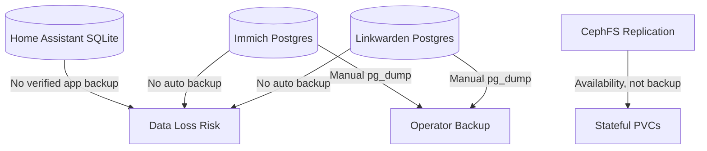

# 💾 Database Backups

This document tracks the backup strategy for databases in the cluster.

## 📌 Current State


```mermaid
flowchart TD
    Linkwarden[(Linkwarden Postgres)] -->|No auto backup| Risk[Data Loss Risk]
    Immich[(Immich Postgres)] -->|No auto backup| Risk
    CephFS[CephFS Replication] -->|Availability, not backup| PVC[Stateful PVCs]
    HomeAssistant[(Home Assistant SQLite)] -->|No verified app backup| Risk
    Linkwarden -->|Manual pg_dump| Dump[Operator Backup]
    Immich -->|Manual pg_dump| Dump
```

### 🗄️ Database Inventory

| App            | Namespace    | Data / PVC                             | Backup Strategy                                                     |
| -------------- | ------------ | -------------------------------------- | ------------------------------------------------------------------- |
| Linkwarden     | productivity | linkwarden-postgres-data (CephFS)      | None currently                                                      |
| Immich         | media        | immich-database-data (CephFS)          | None currently                                                      |
| Home Assistant | home         | SQLite recorder and `/config` (CephFS) | External CephFS backup is described; cadence and restore unverified |

## 📝 Notes

-   CephFS replication protects storage availability; it is not a backup
-   No application-level automated database backup is defined in this repository
-   The storage guide says CephFS backups are handled by Proxmox jobs configured in Ansible. Those jobs, their retention, and a successful restore are outside this repository and must be verified independently.
-   Home Assistant's SQLite recorder and UI state live in `/config`. The database backup strategy does not configure an application-level Home Assistant backup.
-   For production, consider:
    -   [Kasten K10](https://www.kasten.io/) - Kubernetes-native backup
    -   [Velero](https://velero.io/) - Generic K8s backup
    -   Custom cron job with pg_dump

## 💾 Manual Backup Example

To manually backup Linkwarden database:

```bash
kubectl exec -n productivity linkwarden-database-0 -- pg_dump -U linkwarden -d linkwarden > linkwarden-backup.sql
```

## 🔄 Recovery

For recovery instructions, see [Troubleshooting](/docs/operations/troubleshooting.md).
