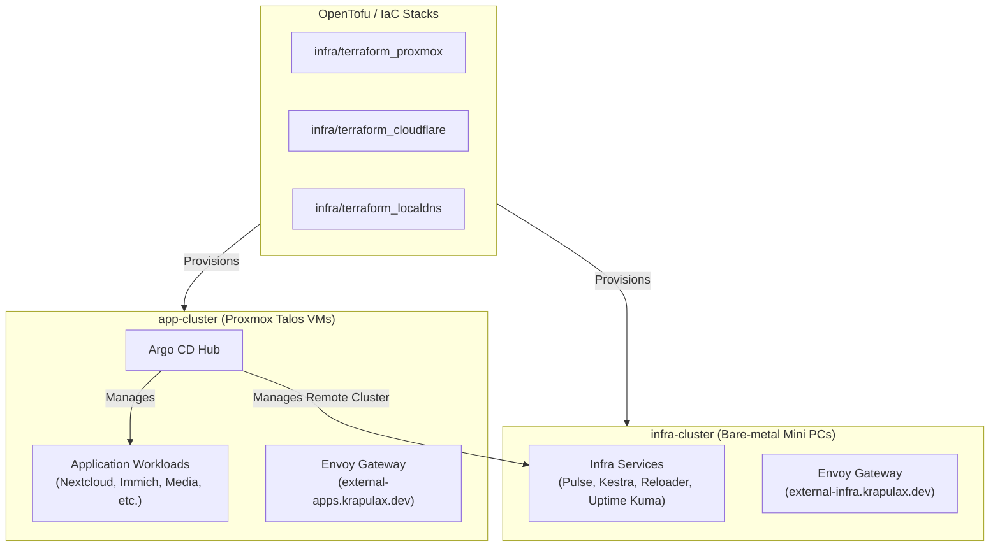

# ☸️ Dual-Cluster Installation & Deployment Guide

This guide provides a comprehensive, step-by-step installation and deployment process for the homelab Kubernetes estate managed by this repository.

> [!NOTE] > **Lineage & Origin**: This cluster architecture was originally bootstrapped from [`ajaykumar4/cluster-template`](https://github.com/ajaykumar4/cluster-template) (utilizing Talos Linux, Argo CD, and `bjw-s/app-template` patterns). It has evolved into a dual-cluster topology (`app-cluster` and `infra-cluster`) managed by a single central Argo CD GitOps hub.

---

## 🏛️ Architecture Overview



| Cluster             | Platform                          | Role                                                     | Kubeconfig Path                       |
| :------------------ | :-------------------------------- | :------------------------------------------------------- | :------------------------------------ |
| **`app-cluster`**   | Proxmox VMs (Talos Linux)         | General workloads & Argo CD GitOps Hub                   | `./kubeconfig`                        |
| **`infra-cluster`** | Bare-metal Mini PCs (Talos Linux) | Baseline infrastructure, monitoring, & fallback services | `./.private/infra-cluster/kubeconfig` |

---

## 💻 Phase 1: Workstation Setup & Dependencies

Enter the Nix development environment to ensure all required CLI tools (`tofu`, `talosctl`, `kubectl`, `helm`, `sops`, `age`, `doppler`, `task`) are at exact, reproducible versions:

```bash
# Enter Nix dev shell

nix develop

# Install required Helm plugins and dependencies

task deps
```

Set up environment variables via `direnv` or standard exports:

```bash
cat > .envrc <<'EOF'
export KUBECONFIG="$PWD/kubeconfig"
export TALOSCONFIG="$PWD/talos/app/clusterconfig/talosconfig"
export SOPS_AGE_KEY_FILE="$PWD/age.key"
EOF
direnv allow .
```

---

## 🔐 Phase 2: Secret Engines & Key Management

### 🔹 1. Age Key for SOPS

The committed SOPS files (`*.sops.yaml`) and `.sops.yaml` in this repository are encrypted using the repository recipient (`age1saea3t7l67lavg0ardepzys6egp50g82uvks98pk53xdlj57uf8sa2arcs`).

-   **Existing Cluster / Operator**: Retrieve the matching private Age key from secure storage (e.g. 1Password / Doppler / backup) and write it to `./age.key` (or `$SOPS_AGE_KEY_FILE`):
    ```bash
    # Ensure the private key file exists locally and is ignored by Git
    cat age.key
    ```
-   **New Repository Fork**: If bootstrapping a fresh repository fork with a new key pair:

    ```bash
    # 1. Generate key pair
    age-keygen -o age.key

    # 2. Extract public key recipient
    age-keygen -y age.key

    # 3. Update the recipient in .sops.yaml and re-encrypt all secrets
    task template:encrypt-secrets
    ```

### 🔐 2. Doppler Secret Management

Ensure access to Doppler projects (`project-homelab`):

```bash
doppler login
doppler setup --project project-homelab --config dev_homelab
```

---

## 🏗️ Phase 3: Infrastructure Provisioning (OpenTofu)

Infrastructure stacks are managed independently using OpenTofu under `infra/`:

```bash
# Initialize all OpenTofu modules (Proxmox, Cloudflare, Local DNS)

task tf:init

# Review execution plan

task tf:plan

# Apply infrastructure changes

task tf:apply
```

Or apply specific stacks individually:

-   **Proxmox VMs**: `task tf:proxmox:plan` && `task tf:proxmox:apply`
-   **Cloudflare Tunnels & DNS**: `task tf:cloudflare:plan` && `task tf:cloudflare:apply`
-   **Local DNS Records**: `task tf:localdns:plan` && `task tf:localdns:apply`

_Note_: The Proxmox VM provisioning script automatically updates `nodes.yaml` with IP and MAC address assignments.

---

## ☸️ Phase 4: Talos Cluster Bootstrap

### ☸️ 1. Provisioning `app-cluster` (Proxmox VMs)

Target the control-plane nodes configured in `talos/app/talconfig.yaml` (`10.0.40.90`, `10.0.40.91`, `10.0.40.92`):

```bash
# 1. Generate machine configurations

task talos:app:generate-config

# 2. Apply machine configs to control-plane nodes

task talos:app:apply-node IP=10.0.40.90
task talos:app:apply-node IP=10.0.40.91
task talos:app:apply-node IP=10.0.40.92

# 3. Bootstrap etcd on the first control plane node

task talos:app:bootstrap

# 4. Fetch kubeconfig

task talos:app:kubeconfig
```

### ☸️ 2. Provisioning `infra-cluster` (Physical Mini PCs)

Follow [docs/INFRA_CLUSTER_BOOTSTRAP.md](../INFRA_CLUSTER_BOOTSTRAP.md) for bare-metal setup:

```bash
# Generate infra cluster machine configs

task talos:infra:bootstrap

# Fetch infra cluster kubeconfig

task talos:infra:kubeconfig

# Install Cilium CNI on infra-cluster

task talos:infra:cilium
```

---

## ☸️ Phase 5: GitOps Hub & Dual-Cluster Argo CD Bootstrap

1. **Deploy Argo CD Hub on `app-cluster`**:

    ```bash
    task apps:bootstrap
    ```

2. **Register `infra-cluster` as a Target Destination**:

    ```bash
    # Add remote cluster credentials into Argo CD running on app-cluster
    argocd cluster add infra-cluster --kubeconfig .private/infra-cluster/kubeconfig --name infra-cluster
    ```

3. **Verify Cluster Registration**:
    ```bash
    argocd cluster list
    ```

---

## 💾 Phase 6: Application Structure & Storage Standards

Workloads are committed under cluster-specific directory trees:

```text
kubernetes/
├── apps/
│   ├── app-cluster/           # Workloads targeting app-cluster
│   │   ├── default/
│   │   ├── media/
│   │   └── productivity/
│   └── infra-cluster/         # Workloads targeting infra-cluster
│       ├── monitoring/
│       └── automation/
└── argo/
    └── apps/
        ├── app-cluster/       # Argo Application manifests targeting app-cluster
        └── infra-cluster/     # Argo Application manifests targeting infra-cluster
```

### 💾 Storage Conventions (Strict Rule)

-   **Application Configs**: Use `storageClass: cephfs` for all configuration PVCs across all namespaces.
-   **Media & Downloads**: Use `existingClaim: media-library-pvc` (NFS share at `10.0.40.2:/media`). Never create new PVs with `Delete` reclaim policy.

---

## ✅ Phase 7: Verification & Health Checks

Verify total cluster health across both control plane and workloads:

```bash
# Verify app-cluster and infra-cluster statuses

task clusters:status

# Verify Kubernetes node readiness

kubectl get nodes -o wide

# Check Argo CD sync status

argocd app list

# Run comprehensive verification suite

task verify:cluster
```

## ↩️ Phase-Specific Rollback Procedures

If an installation step fails or requires reversal, follow the corresponding phase rollback procedure:

### 🏗️ Rollback Phase 3: Infrastructure Provisioning (OpenTofu)

-   **Proxmox VMs**: To destroy provisioned control-plane VMs without removing Cloudflare tunnels:
    ```bash
    task tf:proxmox:destroy
    ```
-   **Cloudflare Tunnels & DNS**: To revert DNS or tunnel changes:
    ```bash
    task tf:cloudflare:destroy
    ```
-   **Full Infrastructure Teardown**: Destroy all OpenTofu stacks in reverse dependency order:
    ```bash
    task tf:destroy
    ```

### ☸️ Rollback Phase 4: Talos Cluster & Node Reset

-   **Reset Nodes**: To wipe etcd, destroy cluster state, and return nodes back to maintenance mode:
    ```bash
    task talos:reset
    ```
-   **Reintroduce Worker Nodes**: To restore worker node capacity, re-add worker entries in `nodes.yaml`, regenerate Talos config (`task talos:genconfig`), and re-apply machine configs.

### ☸️ Rollback Phase 5: Argo CD & Remote Cluster Registration

-   **Unregister Spoke Cluster**: Remove `infra-cluster` from the Argo CD hub running on `app-cluster`:
    ```bash
    argocd cluster rm infra-cluster
    ```
-   **Repoint Argo CD Hub**: To repoint Argo CD to an earlier repository or branch:
    ```bash
    kubectl -n argo-system apply -f kubernetes/components/common/repositories.yaml
    ```

### ↩️ Rollback Phase 6/7: Workload GitOps Rollback

-   **Disable Auto-Sync**: Prevent Argo CD from syncing broken workload manifests:
    ```bash
    argocd app set <app-name> --sync-policy none
    ```
-   **Revert Git State**: Revert the workload commit on your git branch and push to trigger an automated rollback sync.

---

## 🚑 Troubleshooting & Maintenance

-   **Lens Setup**: Generate a combined kubeconfig for Lens cluster browsing:
    ```bash
    task clusters:lens-kubeconfig
    ```
    Import `.private/lens.kubeconfig` into Lens.
-   **Node Upgrades**: Upgrade Talos OS version safely:
    ```bash
    task talos:app:upgrade-node IP=10.0.40.90 VERSION=v1.9.0
    ```
-   **Secrets Troubleshooting**: If `DopplerSecret` fails to sync, check doppler-operator logs:
    ```bash
    kubectl logs -n doppler-operator-system deployment/doppler-operator-controller-manager
    ```
