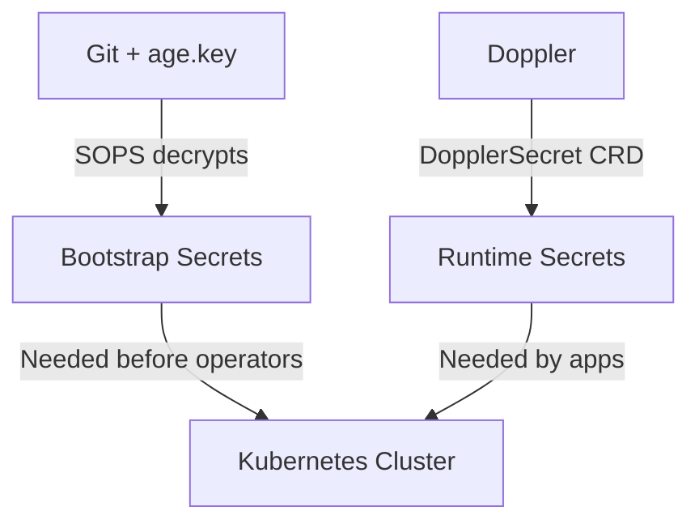

# 🔐 Secret Strategy

This repository uses two secret layers:



-   **SOPS/age** for secrets required before Kubernetes secret operators can run.
-   **Doppler** for runtime application secrets synced into Kubernetes by the Doppler operator.

Do not move bootstrap secrets into Doppler or another in-cluster operator. If the
operator is unavailable during rebuild, those secrets must still be available
from Git plus the local age key.

## 🥾 Bootstrap Setup

Run this from a fresh checkout before building or rebuilding the clusters:

```bash
nix develop
task deps
task secrets:validate-bootstrap
```

The validator checks:

-   `.sops.yaml` exists
-   `age.key` exists and matches the SOPS recipient
-   required bootstrap SOPS files exist
-   every `*.sops.yaml` file can be decrypted locally
-   current Doppler project/config references are visible for review

It never prints decrypted secret values.

### 🔹 Age Key

The age private key is local-only:

```text
age.key
```

Create a new key only for a new trust root:

```bash
age-keygen --output age.key
age-keygen -y age.key
```

Add the public recipient from `age-keygen -y age.key` to `.sops.yaml`, then
re-encrypt every SOPS file:

```bash
task template:encrypt-secrets
task secrets:validate-bootstrap
```

Back up `age.key` in the primary human password manager. Losing it means the
encrypted bootstrap material in Git cannot be recovered.

## 📌 SOPS Inventory

### 🔹 Must Remain In SOPS

These are needed before or during cluster bootstrap:

| File                                                                                                   | Reason                                                           |
| ------------------------------------------------------------------------------------------------------ | ---------------------------------------------------------------- |
| `talos/app/talsecret.sops.yaml`                                                                        | Talos cluster identity and Kubernetes secret encryption material |
| `talos/app/patches/global/machine-registries.sops.yaml`                                                | Node registry auth before Kubernetes exists                      |
| `kubernetes/components/common/helm-secrets-private-keys.sops.yaml`                                     | Argo repo-server age key for decrypting SOPS values              |
| `kubernetes/argo/repositories/github.sops.yaml`                                                        | Argo Git repository access before runtime operators exist        |
| `kubernetes/apps/app-cluster/argo-system/argo-cd/values.sops.yaml`                                     | Argo bootstrap secret settings                                   |
| `kubernetes/apps/app-cluster/doppler-operator-system/doppler-operator/config/secret.sops.yaml`         | App-cluster Doppler operator token                               |
| `kubernetes/apps/infra-cluster/doppler-operator-system/doppler-operator-infra/config/secret.sops.yaml` | Infra-cluster Doppler operator token                             |
| `kubernetes/apps/app-cluster/kube-system/ceph-csi/secret.sops.yaml`                                    | Ceph credentials needed before app storage is reliable           |
| `kubernetes/apps/app-cluster/kube-system/ceph-csi/values.sops.yaml`                                    | Ceph CSI sensitive values                                        |
| `kubernetes/apps/app-cluster/storage/ceph-csi/values.sops.yaml`                                        | Ceph CSI sensitive values                                        |

If Doppler is replaced by another operator, the two Doppler token secrets should
be replaced by the equivalent bootstrap token/credentials for that operator.

### 🔹 Candidates To Move Out Of SOPS

These are not required to create the cluster and can move to Doppler or another
external secret manager later:

| File                                                                             | Candidate target                                             |
| -------------------------------------------------------------------------------- | ------------------------------------------------------------ |
| `kubernetes/apps/app-cluster/cert-manager/cert-manager/issuers/secret.sops.yaml` | Doppler runtime secret                                       |
| `kubernetes/apps/app-cluster/network/cloudflare-dns/config/secret.sops.yaml`     | Doppler runtime secret                                       |
| `kubernetes/apps/app-cluster/network/cloudflare-dns/values.sops.yaml`            | Split token into Doppler, keep non-secret chart values plain |
| `kubernetes/apps/app-cluster/network/k8s-gateway/values.sops.yaml`               | Plain values if only domain config remains                   |
| `kubernetes/apps/app-cluster/monitoring/kube-prometheus-stack/values.sops.yaml`  | Doppler runtime secret or plain values if no secret remains  |
| HTTPRoute/Gateway/Certificate SOPS manifests                                     | Plain Git if only hostnames/object names are hidden          |

Move these only after the Doppler project split has proven stable.

## 📌 Doppler Target Layout

The current desired Doppler project is:

```text
project: home-dc-kubernetes
config: apps
config: infra
```

The existing `dev` and `dev_personal` configs may remain for local development,
but Kubernetes runtime secrets should use only:

-   `apps` for `app-cluster`
-   `infra` for `infra-cluster`

Create one service token per cluster config:

```bash
doppler configs tokens create app-cluster-operator \
  --project home-dc-kubernetes \
  --config apps \
  --plain

doppler configs tokens create infra-cluster-operator \
  --project home-dc-kubernetes \
  --config infra \
  --plain
```

Store each token in the matching SOPS file:

```text
kubernetes/apps/app-cluster/doppler-operator-system/doppler-operator/config/secret-apps.sops.yaml
kubernetes/apps/infra-cluster/doppler-operator-system/doppler-operator-infra/config/secret-infra.sops.yaml
```

Then verify:

```bash
task secrets:validate-bootstrap
```

## 📌 Doppler Inventory

### ☸️ App Cluster

| Managed Secret               | Namespace      | Keys                                                                        |
| ---------------------------- | -------------- | --------------------------------------------------------------------------- |
| `arc-github-app-secret`      | `arc-system`   | `GITHUB_APP_ID`, `GITHUB_APP_INSTALLATION_ID`, `GITHUB_APP_PRIVATE_KEY`     |
| `immich-secrets`             | `media`        | `IMMICH_DB_PASSWORD`                                                        |
| `recyclarr-secrets`          | `media`        | `SONARR_API_KEY`, `RADARR_API_KEY`                                          |
| `alertmanager-slack-webhook` | `monitoring`   | `SLACK_WEBHOOK_MONITORING`                                                  |
| `cloudflare-tunnel-secret`   | `network`      | `TUNNEL_TOKEN_APPS` as `TUNNEL_TOKEN`                                       |
| `code-server-secrets`        | `productivity` | `CODE_SERVER_PASSWORD`                                                      |
| `linkwarden-secrets`         | `productivity` | `DATABASE_URL`, `NEXTAUTH_URL`, `NEXTAUTH_SECRET`, `LINKWARDEN_DB_PASSWORD` |
| `n8n-secrets`                | `productivity` | `N8N_ENCRYPTION_KEY`                                                        |

### ☸️ Infra Cluster

| Managed Secret                   | Namespace    | Keys                                                                                  |
| -------------------------------- | ------------ | ------------------------------------------------------------------------------------- |
| `kestra-basic-auth`              | `kestra`     | `KESTRA_BASIC_AUTH_USERNAME`, `KESTRA_BASIC_AUTH_PASSWORD`                            |
| `kestra-postgres`                | `kestra`     | `POSTGRES_USER`, `POSTGRES_PASSWORD`, `POSTGRES_DB`, `USERDB_USER`, `USERDB_PASSWORD` |
| `versitygw-root`                 | `kestra`     | `ROOT_ACCESS_KEY`, `ROOT_SECRET_KEY`                                                  |
| `kestra-homelab-ops`             | `kestra`     | `HOMELAB_SSH_PRIVATE_KEY`, `HOMELAB_SSH_KNOWN_HOSTS`                                  |
| `pulse-agent-token`              | `monitoring` | `PULSE_INFRA_TOKEN`                                                                   |
| `pulse-secrets`                  | `monitoring` | `PULSE_AUTH_USER`, `PULSE_AUTH_PASS`                                                  |
| `uptime-kuma-credentials`        | `monitoring` | `UPTIME_KUMA_USERNAME`, `UPTIME_KUMA_PASSWORD`                                        |
| `cloudflare-tunnel-infra-secret` | `network`    | `TUNNEL_TOKEN_INFRA` as `TUNNEL_TOKEN`                                                |
| `operator-oauth`                 | `tailscale`  | `TAILSCALE_OAUTH_CLIENT_ID`, `TAILSCALE_OAUTH_CLIENT_SECRET`                          |

## 📊 1Password Operator Assessment

1Password remains a viable future target because it is the primary human secret
manager. It is not a no-risk drop-in replacement for this repo yet:

-   it still needs an in-cluster operator credential bootstrapped from SOPS
-   its Kubernetes operator maps whole 1Password items to Kubernetes Secrets
-   it is less granular than the current Doppler `DopplerSecret` key-subset pattern
-   migration would require reshaping 1Password items and replacing the current CRDs

Defer 1Password until the Doppler project/config boundary is clean and the
remaining SOPS candidates have been reduced.
